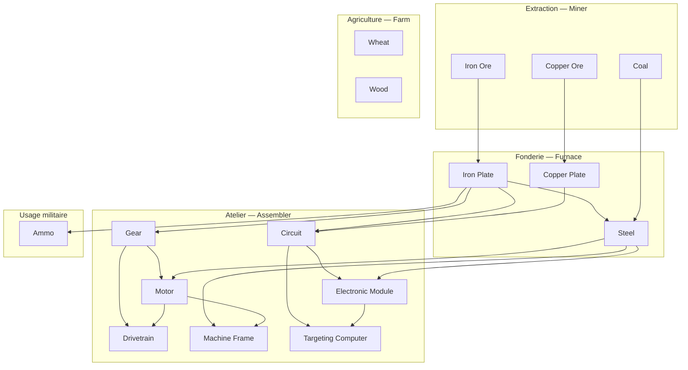

# Resource Tree — Siege Factory

Données sources : `data/resources.toml`, `data/recipes.toml`, `data/discoveries.toml`, `data/buildings.toml`, `data/crops.toml`.

---

## 18 ressources

### Minières (extraction brute)

| ID | Nom | Stack | Couleur |
|---|---|---|---|
| `iron_ore` | Iron Ore | 999 | `#B35F33` |
| `copper_ore` | Copper Ore | 999 | `#D68A4C` |
| `coal` | Coal | 999 | `#444444` |

### Agriculture (cultivée par Farm)

| ID | Nom | Stack | Couleur | Croissance | Rendement |
|---|---|---|---|---|---|
| `wheat` | Wheat | 999 | `#E8C84A` | 15s | ×2 |
| `wood` | Wood | 999 | `#8B5E3C` | 20s | ×1 |

### Metallurgie (Furnace)

| ID | Nom | Stack | Couleur |
|---|---|---|---|
| `iron_plate` | Iron Plate | 999 | `#999999` |
| `copper_plate` | Copper Plate | 999 | `#CC8844` |
| `steel` | Steel | 999 | `#666688` |

### Atelier (Assembler)

| ID | Nom | Stack | Couleur |
|---|---|---|---|
| `gear` | Gear | 999 | `#887766` |
| `circuit` | Circuit | 999 | `#44AA44` |
| `motor` | Motor | 999 | `#AA8844` |
| `electronic_module` | Electronic Module | 999 | `#66CC66` |
| `drivetrain` | Drivetrain | 999 | `#886644` |
| `machine_frame` | Machine Frame | 999 | `#8888AA` |
| `targeting_computer` | Targeting Computer | 999 | `#CC6644` |

### Ressources héritées

| ID | Nom | Stack | Usage |
|---|---|---|---|
| `ore` | Ore | 999 | Coût legacy des bâtiments (remplacement progressif) |
| `ammo` | Ammo | 999 | Munitions tour + coût legacy turret |
| `energy` | Energy | 9999 | Énergie (non craftée, générée par Burner Generator) |

---

## Arbre de production



---

## 14 recettes

### Mining (minerai)

| Recette | Input | Output | Temps | Bâtiment | Débloquée |
|---|---|---|---|---|---|
| `mine_iron_ore` | — | Iron Ore ×1 | 2s | Miner | Oui |
| `mine_copper_ore` | — | Copper Ore ×1 | 2s | Miner | Oui |
| `mine_coal` | — | Coal ×1 | 2s | Miner | Oui |

### Smelting (fonderie — Furnace)

| Recette | Input | Output | Temps | Débloquée |
|---|---|---|---|---|
| `iron_plate` | Iron Ore ×2 | Iron Plate ×1 | 3s | Oui |
| `copper_plate` | Copper Ore ×2 | Copper Plate ×1 | 3s | Oui |
| `steel` | Iron Plate ×3 + Coal ×1 | Steel ×1 | 5s | Découverte (Furnace, 1 craft) |

### Crafting (atelier — Assembler)

| Recette | Input | Output | Temps | Débloquée |
|---|---|---|---|---|
| `gear` | Iron Plate ×2 | Gear ×1 | 2s | Oui |
| `circuit` | Iron Plate ×2 + Copper Plate ×3 | Circuit ×1 | 5s | Oui |
| `ammo_craft` | Iron Plate ×1 | Ammo ×1 | 2s | Oui |
| `motor` | Gear ×1 + Steel ×2 | Motor ×1 | 4s | Découverte (Assembler, 10) |
| `electronic_module` | Circuit ×1 + Steel ×1 | Electronic Module ×1 | 3s | Découverte (Assembler, 25) |
| `drivetrain` | Gear ×2 + Motor ×1 | Drivetrain ×1 | 5s | Découverte (Assembler, 50) |
| `machine_frame` | Steel ×2 + Motor ×1 | Machine Frame ×1 | 6s | Découverte (Assembler, 75) |
| `targeting_computer` | Circuit ×2 + Electronic Module ×1 | Targeting Computer ×1 | 6s | Découverte (Assembler, 100) |

---

## Production agricole (Farm)

La Farm produit des ressources **sans recette** — un système séparé (`crops.toml`) gère la croissance.

| Ressource | Temps de croissance | Rendement |
|---|---|---|
| Wheat | 15s | ×2 |
| Wood | 20s | ×1 |

---

## 15 bâtiments

| Bâtiment | ID | Taille | Coût | HP | Rôle |
|---|---|---|---|---|---|
| HQ | `hq` | 2×2 | — | 100 | Quartier général (indestructible, caché) |
| Miner | `miner` | 1×1 | Ore ×10 | 100 | Extrait ore sur dépôt (10 é/s) |
| Furnace | `furnace` | 1×1 | Ore ×12 | 80 | Fonte, recettes `smelting` |
| Assembler | `assembler` | 1×1 | Ore ×15 | 80 | Assemblage, recettes `crafting` |
| Belt | `belt` | 1×1 | Ore ×3 | 20 | Transport (4 slots, vitesse 2) |
| Wall | `wall` | 1×1 | Ore ×5 | 300 | Mur défensif (drag placement) |
| Turret | `turret` | 1×1 | Ore ×20 + Ammo ×5 | 120 | Tour automatique (dégâts 5, portée 4) |
| Storage | `storage` | 1×1 | Ore ×25 | 150 | Stockage (64 slots) |
| Splitter | `splitter` | 1×1 | Ore ×8 | 30 | Split belts (2 slots, vitesse 2) |
| Sorter | `sorter` | 1×1 | Ore ×10 | 30 | Sort belts (2 slots, vitesse 2) |
| Burner Generator | `burner_generator` | 1×1 | Ore ×20 | 80 | Génère 50 énergie, inventory 16 |
| Power Pole | `power_pole` | 1×1 | Ore ×5 | 10 | Distribution énergie (portée 5) |
| Farm | `farm` | 1×1 | Ore ×15 | 100 | Culture (wheat, wood), inventory 64 |
| Archive | `archive` | 2×2 | Iron Plate ×10 + Gear ×5 | 200 | Archive des découvertes, inventory 1 |

---

## 6 découvertes

| Bâtiment | Seuil | Type | ID | Message |
|---|---|---|---|---|
| Furnace | 1 | recipe | `steel` | The intense heat has fused iron with coal into steel. |
| Assembler | 10 | recipe | `motor` | Gears and steel combine into a compact motor. |
| Assembler | 25 | recipe | `electronic_module` | Circuits fused with steel form a sophisticated electronic module. |
| Assembler | 50 | recipe | `drivetrain` | Multiple motors coupled into a heavy-duty drivetrain. |
| Assembler | 75 | recipe | `machine_frame` | A load-bearing frame for heavy machinery. |
| Assembler | 100 | recipe | `targeting_computer` | A ballistic targeting computer of exceptional precision. |

---

## Recettes de démarrage (prédébloquées)

```
mine_iron_ore    — Miner → Iron Ore
mine_copper_ore  — Miner → Copper Ore
mine_coal        — Miner → Coal
iron_plate       — Furnace → Iron Plate
copper_plate     — Furnace → Copper Plate
gear             — Assembler → Gear
circuit          — Assembler → Circuit
ammo_craft       — Assembler → Ammo
```

---

## Flux de progression

```
1. Miner iron_ore / copper_ore / coal        (débloqué)
2. Furnace iron_plate / copper_plate          (débloqué)
3. Assembler gear / circuit / ammo            (débloqué)
4. Furnace steel (découverte 1 craft) → Archive → permanent
5. Assembler motor  (découverte 10 crafts)   → Archive → permanent
6. Assembler electronic_module (25)           → Archive → permanent
7. Assembler drivetrain (50)                  → Archive → permanent
8. Assembler machine_frame (75)               → Archive → permanent
9. Assembler targeting_computer (100)         → Archive → permanent
```

---

## Unités

| Unité | Coût | PV | Dégâts | Rôle |
|---|---|---|---|---|
| Soldier | Ore ×10 | 30 | 8 (portée 3) | Combat |
| Worker | Ore ×5 | 15 | — (mine 3s) | Récolte minerai |
| Cultivator | Ore ×8 | 10 | — (culture) | Agriculture |
