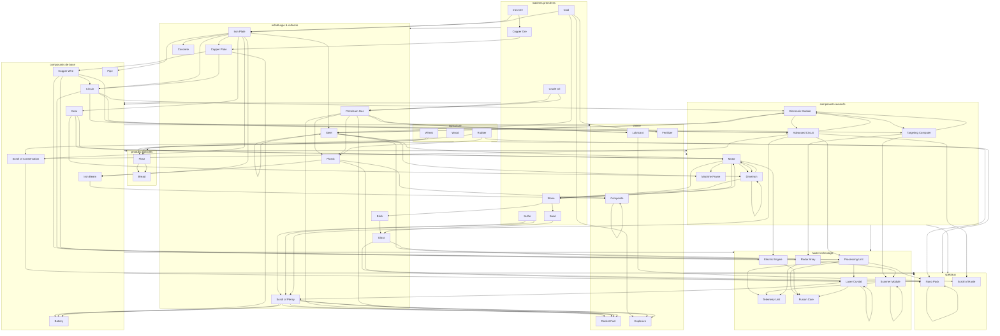

# Resource Tree V2 — 50 items (design)

Expansion de 18 → 50 items, **sans contenu militaire**. Chaque item a un objectif : ingrédient, coût de bâtiment, ou déblocage permanent via Archive.
Aucun déblocage ne téléporte des items ou ne contourne la logistique physique (belts, splitters, sorters).

---

## 50 items

### 1. Matières premières (7)

| # | ID | Source | Objectif |
|---|---|---|---|
| 1 | `iron_ore` | ⛏️ Miner | Iron Plate |
| 2 | `copper_ore` | ⛏️ Miner | Copper Plate |
| 3 | `coal` | ⛏️ Miner | Steel, Explosive, Fertilizer |
| 4 | `stone` | ⛏️ Miner | Brick, Concrete |
| 5 | `sand` | ⛏️ Miner | Glass |
| 6 | `sulfur` | ⛏️ Miner | Sulfur Powder |
| 7 | `crude_oil` | ⛏️ Pumpjack | Petroleum Gas |

### 2. Agriculture (3)

| # | ID | Croissance | Objectif |
|---|---|---|---|
| 8 | `wheat` | 15s ×2 | Flour |
| 9 | `wood` | 20s ×1 | Rubber, combustible early |
| 10 | `rubber` | 25s ×1 | Scroll of Conservation, Nano Pack |

### 3. Métallurgie & Raffinerie (9)

| # | ID | Formule | Objectif | Déblocage Archive |
|---|---|---|---|---|
| 11 | `iron_plate` | Iron Ore ×2 → 1 | Gear, Circuit, Steel, Screw, Pipe, Iron Beam, Concrete, coûts | — |
| 12 | `copper_plate` | Copper Ore ×2 → 1 | Circuit, Copper Wire, Battery, coûts | — |
| 13 | `steel` | Iron Plate ×3 + Coal ×1 → 1 | Motor, Machine Frame, Radar Array, coûts | **Assembly Crane** (×2 craft, ×2 énergie) |
| 14 | `brick` | Stone ×2 → 1 | Blast Furnace | **Blast Furnace** (×2 fonte, +charbon) |
| 15 | `glass` | Sand ×2 → 1 | Laser Crystal | **Arboretum** (serre : boost croissance rayons voisins +50 %) |
| 16 | `concrete` | Stone ×2 + Iron Plate ×1 → 1 | Cobblestone Path | **Cobblestone Path** (dalle : +30 % vitesse déplacement) |
| 17 | `plastic` | Petroleum Gas ×2 → 1 | Advanced Circuit, Nano Pack, Compactor | **Compactor** (caisse : 4× stack items → ×4 débit sur belts) |
| 18 | `sulfur_powder` | Sulfur ×1 → 2 | Battery, Explosive, Fertilizer | — |
| 19 | `petroleum_gas` | Crude Oil ×2 → 3 | Plastic, Lubricant, Rocket Fuel | — |

### 4. Composants de base (7)

| # | ID | Formule | Objectif | Déblocage Archive |
|---|---|---|---|---|
| 20 | `gear` | Iron Plate ×2 → 1 | Motor, Drivetrain, coût Assembler | — |
| 21 | `circuit` | Iron Plate ×2 + Copper Plate ×3 → 1 | Electronic Module, Advanced Circuit, Targeting Computer, Radar Array | — |
| 22 | `copper_wire` | Copper Plate ×1 → 4 | Circuit, Advanced Circuit, Processing Unit, Electric Engine | — |
| 23 | `screw` | Iron Plate ×1 → 2 | Engineering Bay | **Engineering Bay** (coûts bâtiments -10 % permanent) |
| 24 | `pipe` | Iron Plate ×2 → 1 | Alchemy Lab | **Alchemy Lab** (usine chimique) |
| 25 | `iron_beam` | Iron Plate ×2 → 1 | Machine Frame, Composite | **Warehouse Crane** (×2 capacité tous les stocks) |
| 26 | `battery` | Copper Plate ×1 + Sulfur Powder ×1 → 1 | Grand Counterweight | **Grand Counterweight** (stocke énergie : surplus → lève le poids, pénurie → le descend) |

### 5. Produits agricoles (2)

| # | ID | Formule | Objectif | Déblocage Archive |
|---|---|---|---|---|
| 27 | `flour` | Wheat ×2 → 1 | Bread | — |
| 28 | `bread` | Flour ×2 → 1 | Consommable : +20 % vitesse déplacement 30s | **Guild Hall** (buff zone pour les Workers : +15 % vitesse) |

### 6. Chimie (5)

| # | ID | Formule | Objectif | Déblocage Archive |
|---|---|---|---|---|
| 29 | `lubricant` | Petroleum Gas ×1 → 1 | Scroll of Haste, High-Speed Track | **High-Speed Track** (belt ×2 vitesse, consomme énergie) |
| 30 | `rocket_fuel` | Petroleum Gas ×2 + Sulfur Powder ×1 → 1 | Steam Wagon | **Steam Wagon** (véhicule pilotable, déplacement rapide) |
| 31 | `explosive` | Sulfur Powder ×2 + Coal ×1 → 1 | Excavation Rig | **Excavation Rig** (bâtiment posé sur obstacles : les creuse, donne Stone/Wood) |
| 32 | `fertilizer` | Sulfur ×1 + Coal ×1 → 2 | Fertile Grounds | **Fertile Grounds** (permanent : toutes les Farms +50 % vitesse) |
| 33 | `composite` | Plastic ×1 + Iron Beam ×1 → 1 | Deep Core Drill | **Deep Core Drill** (foreuse : extrait tous les minerais simultanément, 1 seul bâtiment) |

### 7. Composants avancés (6)

| # | ID | Formule | Objectif | Déblocage Archive |
|---|---|---|---|---|
| 34 | `motor` | Gear ×1 + Steel ×2 → 1 | Drivetrain, Electric Engine, Machine Frame | — |
| 35 | `electronic_module` | Circuit ×1 + Steel ×1 → 1 | Targeting Computer, Advanced Circuit | — |
| 36 | `drivetrain` | Gear ×2 + Motor ×1 → 1 | Steam Wagon, Hauler | — |
| 37 | `machine_frame` | Steel ×2 + Motor ×1 → 1 | Mass Schematic | **Mass Schematic** (outil : upgrade tous les bâtiments d'un type dans une zone) |
| 38 | `targeting_computer` | Circuit ×2 + Electronic Module ×1 → 1 | Scanner Module, Scribing Desk | **Scribing Desk** (bâtiment : produit un Schematic à partir d'une config, consommé à l'usage) |
| 39 | `advanced_circuit` | Circuit ×2 + Plastic ×1 + Copper Wire ×4 → 1 | Processing Unit, Scrolls | **Enchanting Array** (bâtiment : applique des Enhancement Scrolls aux bâtiments adjacents) |

### 8. Haute technologie (7)

| # | ID | Formule | Objectif | Déblocage Archive |
|---|---|---|---|---|
| 40 | `processing_unit` | Advanced Circuit ×2 + Copper Wire ×4 → 1 | Fusion Core, Nano Pack, Telemetry Unit | **Assembly Matrix** (bâtiment adjacent à un producteur : le mime à 50 % de vitesse) |
| 41 | `electric_engine` | Motor ×1 + Copper Wire ×4 → 1 | Fusion Core | **Hauler** (véhicule cargo autonome qui suit des routes, inventory + déplacement) |
| 42 | `laser_crystal` | Glass ×1 + Processing Unit ×1 → 1 | Scanner Module, Scroll of Plenty | **Surveyor's Scope** (outil : scanne le gisement non exploité le plus proche) |
| 43 | `radar_array` | Circuit ×2 + Steel ×2 → 1 | Scanner Module, Telemetry Unit | **Watchtower** (tour : révèle la carte par pings périodiques) |
| 44 | `scanner_module` | Targeting Computer ×1 + Radar Array ×1 → 1 | — | **Prospector's Map** (permanent : révèle tous les gisements dans le rayon des Watchtowers) |
| 45 | `telemetry_unit` | Radar Array ×1 + Processing Unit ×1 → 1 | — | **Chronicle** (UI : graphiques de production, ratios, historique) |
| 46 | `fusion_core` | Laser Crystal ×1 + Electric Engine ×1 + Processing Unit ×1 → 1 | — | **Thermal Bore** (bâtiment : énergie géothermique continue, consomme Stone comme carburant) |

### 9. Spéciaux / Enhancement Scrolls (4)

| # | ID | Formule | Objectif | Déblocage Archive |
|---|---|---|---|---|
| 47 | `nano_pack` | Processing Unit ×1 + Plastic ×1 + Rubber ×1 → 1 | — | **Mending Aura** (permanent : tous les bâtiments régénèrent lentement leurs PV) |
| 48 | `scroll_of_haste` | Advanced Circuit ×1 + Lubricant ×1 → 1 | Enchanting Array : +50 % vitesse ×1 bâtiment | — (recette débloquée via Advanced Circuit) |
| 49 | `scroll_of_plenty` | Advanced Circuit ×1 + Laser Crystal ×1 → 1 | Enchanting Array : +20 % rendement ×1 bâtiment | — |
| 50 | `scroll_of_conservation` | Advanced Circuit ×1 + Rubber ×1 → 1 | Enchanting Array : -30 % conso énergie ×1 bâtiment | — |

---

## Récapitulatif des déblocages Archive

| Item | Déblocage | Type | Original ? |
|---|---|---|---|
| Brick | **Blast Furnace** (×2 fonte, +charbon) | Building | ✅ tradeoff |
| Steel | **Assembly Crane** (×2 craft, ×2 énergie) | Building | ✅ tradeoff |
| Glass | **Arboretum** (boost culture voisine) | Building | ✅ renommé |
| Concrete | **Cobblestone Path** (+30% vitesse) | Placeable | ✅ renommé |
| Pipe | **Alchemy Lab** (usine chimique) | Building | ✅ renommé |
| Screw | **Engineering Bay** (-10% coûts) | Permanent | ✅ renommé |
| Iron Beam | **Warehouse Crane** (×2 capacité stocks) | Permanent | ✅ nouveau |
| Battery | **Grand Counterweight** (poids → stockage énergie) | Building | ✅ Timberborn-inspired |
| Plastic | **Compactor** (caisse 4× stack → ×4 débit belts) | Building | ✅ nouveau |
| Bread | **Guild Hall** (buff zone Workers) | Building | ✅ renommé |
| Lubricant | **High-Speed Track** (belt ×2, consomme énergie) | Building | ✅ tradeoff |
| Rocket Fuel | **Steam Wagon** (véhicule pilotable) | Vehicle | ✅ |
| Explosive | **Excavation Rig** (déblaie obstacles → ressources) | Building | ✅ original |
| Fertilizer | **Fertile Grounds** (boost Farm ×1.5 permanent) | Permanent | ✅ |
| Composite | **Deep Core Drill** (tous minerais simultanés) | Building | ✅ original |
| Machine Frame | **Mass Schematic** (upgrade zone) | Tool | ✅ renommé |
| Targeting Computer | **Scribing Desk** (copier/coller config) | Building | ✅ |
| Advanced Circuit | **Enchanting Array** (applique scrolls) | Building | ✅ nouveau |
| Processing Unit | **Assembly Matrix** (mime voisin à 50%) | Building | ✅ nouveau |
| Electric Engine | **Hauler** (véhicule cargo autonome) | Vehicle | ✅ nouveau |
| Laser Crystal | **Surveyor's Scope** (trouve gisement) | Tool | ✅ renommé |
| Radar Array | **Watchtower** (pings carte) | Building | ✅ |
| Scanner Module | **Prospector's Map** (révèle gisements) | Permanent | ✅ renommé |
| Telemetry Unit | **Chronicle** (stats production) | UI | ✅ |
| Fusion Core | **Thermal Bore** (énergie géothermique) | Building | ✅ original |
| Nano Pack | **Mending Aura** (régénération bâtiments) | Permanent | ✅ |

### Enhancement Scrolls (via Enchanting Array)

| Scroll | Coût | Effet | Usage |
|---|---|---|---|
| Scroll of Haste | Adv. Circuit + Lubricant | +50% vitesse prod | Consommé sur 1 bâtiment |
| Scroll of Plenty | Adv. Circuit + Laser Crystal | +20% rendement | Consommé sur 1 bâtiment |
| Scroll of Conservation | Adv. Circuit + Rubber | -30% énergie | Consommé sur 1 bâtiment |

---

## Arbre Mermaid complet



---

## Bilan

| Branche | Items | Nouveaux |
|---|---|---|
| Matières premières | 7 | +4 (stone, sand, sulfur, crude_oil) |
| Agriculture | 3 | +1 (rubber) |
| Métallurgie & Raffinerie | 9 | +6 (brick, glass, concrete, plastic, sulfur_powder, petroleum_gas) |
| Composants de base | 7 | +4 (copper_wire, screw, pipe, iron_beam) + battery |
| Produits agricoles | 2 | +2 (flour, bread) |
| Chimie | 5 | +5 |
| Composants avancés | 6 | +3 (advanced_circuit, processing_unit, electric_engine) |
| Haute technologie | 7 | +6 (laser_crystal, radar_array, scanner_module, telemetry_unit, fusion_core, nano_pack) |
| Spéciaux / Scrolls | 4 | +4 |
| **Total** | **50** | **+35 nouveaux** |

---

## Nouvelles recettes (37)

| Recette | Catégorie | Input | Output | Temps | Bâtiment |
|---|---|---|---|---|---|
| `mine_stone` | mining | — | Stone ×1 | 2s | Miner |
| `mine_sand` | mining | — | Sand ×1 | 2s | Miner |
| `mine_sulfur` | mining | — | Sulfur ×1 | 3s | Miner |
| `pump_crude_oil` | pumping | — | Crude Oil ×1 | 3s | Pumpjack |
| `brick` | smelting | Stone ×2 | Brick ×1 | 4s | Furnace / Blast Furnace |
| `glass` | smelting | Sand ×2 | Glass ×1 | 4s | Furnace / Blast Furnace |
| `concrete` | smelting | Stone ×2 + Iron Plate ×1 | Concrete ×1 | 6s | Furnace / Blast Furnace |
| `sulfur_powder` | smelting | Sulfur ×1 | Sulfur Powder ×2 | 3s | Furnace / Blast Furnace |
| `plastic` | refining | Petroleum Gas ×2 | Plastic ×1 | 4s | Alchemy Lab |
| `petroleum_gas` | refining | Crude Oil ×2 | Petroleum Gas ×3 | 5s | Alchemy Lab |
| `lubricant` | refining | Petroleum Gas ×1 | Lubricant ×1 | 3s | Alchemy Lab |
| `rocket_fuel` | refining | Petroleum Gas ×2 + Sulfur Powder ×1 | Rocket Fuel ×1 | 6s | Alchemy Lab |
| `explosive` | refining | Sulfur Powder ×2 + Coal ×1 | Explosive ×1 | 5s | Alchemy Lab |
| `fertilizer` | refining | Sulfur ×1 + Coal ×1 | Fertilizer ×2 | 4s | Alchemy Lab |
| `copper_wire` | crafting | Copper Plate ×1 | Copper Wire ×4 | 2s | Assembler / Assembly Crane |
| `screw` | crafting | Iron Plate ×1 | Screw ×2 | 1.5s | Assembler / Assembly Crane |
| `pipe` | crafting | Iron Plate ×2 | Pipe ×1 | 3s | Assembler / Assembly Crane |
| `battery` | crafting | Copper Plate ×1 + Sulfur Powder ×1 | Battery ×1 | 5s | Assembler |
| `iron_beam` | forging | Iron Plate ×2 | Iron Beam ×1 | 4s | Foundry |
| `flour` | crafting | Wheat ×2 | Flour ×1 | 3s | Guild Hall |
| `bread` | cooking | Flour ×2 | Bread ×1 | 4s | Guild Hall |
| `composite` | refining | Plastic ×1 + Iron Beam ×1 | Composite ×1 | 5s | Alchemy Lab |
| `advanced_circuit` | electronics | Circuit ×2 + Plastic ×1 + Copper Wire ×4 | Advanced Circuit ×1 | 6s | Electronics Lab |
| `processing_unit` | electronics | Advanced Circuit ×2 + Copper Wire ×4 | Processing Unit ×1 | 8s | Electronics Lab |
| `electric_engine` | forging | Motor ×1 + Copper Wire ×4 | Electric Engine ×1 | 6s | Foundry |
| `machine_frame` | forging | Steel ×2 + Motor ×1 | Machine Frame ×1 | 6s | Foundry |
| `laser_crystal` | electronics | Glass ×1 + Processing Unit ×1 | Laser Crystal ×1 | 8s | Electronics Lab |
| `radar_array` | crafting | Circuit ×2 + Steel ×2 | Radar Array ×1 | 6s | Assembler |
| `scanner_module` | electronics | Targeting Computer ×1 + Radar Array ×1 | Scanner Module ×1 | 8s | Electronics Lab |
| `telemetry_unit` | electronics | Radar Array ×1 + Processing Unit ×1 | Telemetry Unit ×1 | 8s | Electronics Lab |
| `fusion_core` | electronics | Laser Crystal ×1 + Electric Engine ×1 + Processing Unit ×1 | Fusion Core ×1 | 12s | Electronics Lab |
| `nano_pack` | electronics | Processing Unit ×1 + Plastic ×1 + Rubber ×1 | Nano Pack ×1 | 8s | Electronics Lab |
| `scroll_of_haste` | enchanting | Advanced Circuit ×1 + Lubricant ×1 | Scroll of Haste ×1 | 6s | Enchanting Array |
| `scroll_of_plenty` | enchanting | Advanced Circuit ×1 + Laser Crystal ×1 | Scroll of Plenty ×1 | 8s | Enchanting Array |
| `scroll_of_conservation` | enchanting | Advanced Circuit ×1 + Rubber ×1 | Scroll of Conservation ×1 | 6s | Enchanting Array |

---

## Nouveaux bâtiments

| Bâtiment | Rôle | Catégories recettes | Débloqué par |
|---|---|---|---|
| Pumpjack | Pompage pétrole brut | `pumping` | Démarrage |
| Alchemy Lab | Chimie (plastique, carburant, explosifs) | `refining` | Pipe → Archive |
| Electronics Lab | Circuits avancés, optiques, calcul | `electronics` | Démarrage (ou déblocage précoce) |
| Foundry | Forge lourde (poutres, moteurs, châssis) | `forging` | Démarrage (ou déblocage précoce) |
| Blast Furnace | Fonte ×2, brûle +charbon | `smelting` | Brick → Archive |
| Assembly Crane | Craft ×2, ×2 énergie | `crafting` | Steel → Archive |
| Arboretum | Boost culture voisine passif | — | Glass → Archive |
| Guild Hall | Buff zone Workers, cuit Bread | `cooking` | Bread → Archive |
| Enchanting Array | Applique des scrolls aux bâtiments adjacents | `enchanting` | Advanced Circuit → Archive |
| Scribing Desk | Produit des Schematics (copie config) | — | Targeting Computer → Archive |
| Excavation Rig | Déblaie obstacles → Stone/Wood | — | Explosive → Archive |
| Grand Counterweight | Stockage énergie (poids) | — | Battery → Archive |
| Deep Core Drill | Foreuse unique : tous minerais | `mining` | Composite → Archive |
| Compactor | Comprime les items en caisses (×4 stack → ×4 débit) | — | Plastic → Archive |
| High-Speed Track | Belt ×2 vitesse, nécessite énergie | — | Lubricant → Archive |
| Watchtower | Révèle carte par pings | — | Radar Array → Archive |
| Assembly Matrix | Bâtiment adjacent : mime le voisin à 50% | — | Processing Unit → Archive |
| Thermal Bore | Énergie géothermique, consomme Stone | — | Fusion Core → Archive |
| Cobblestone Path | Dalle posable +30% vitesse | — | Concrete → Archive |
| Warehouse Crane | ×2 capacité stocks (permanent) | — | Iron Beam → Archive |
| Engineering Bay | -10% coûts bâtiments (permanent) | — | Screw → Archive |
| Fertile Grounds | Boost Farm ×1.5 (permanent) | — | Fertilizer → Archive |
| Prospector's Map | Révèle gisements sur carte (permanent) | — | Scanner Module → Archive |
| Mending Aura | Régénération bâtiments (permanent) | — | Nano Pack → Archive |
| Surveyor's Scope | Outil : scan gisement le plus proche | — | Laser Crystal → Archive |
| Mass Schematic | Outil : upgrade zone | — | Machine Frame → Archive |
| Steam Wagon | Véhicule pilotable | — | Rocket Fuel → Archive |
| Hauler | Véhicule cargo autonome | — | Electric Engine → Archive |
| Chronicle | UI stats production | — | Telemetry Unit → Archive |

---

## Découvertes (design)

| Bâtiment | Seuil | Débloque |
|---|---|---|
| Furnace | 1 | Steel |
| Furnace | 5 | Brick |
| Furnace | 15 | Glass |
| Furnace | 30 | Concrete |
| Furnace | 10 | Sulfur Powder |
| Assembler | 10 | Motor |
| Assembler | 25 | Electronic Module |
| Assembler | 50 | Drivetrain |
| Assembler | 75 | Machine Frame |
| Assembler | 100 | Targeting Computer |
| Assembler | 5 | Screw |
| Assembler | 10 | Pipe |
| Assembler | 10 | Battery |
| Assembler | 15 | Radar Array |
| Alchemy Lab | 5 | Plastic |
| Alchemy Lab | 15 | Lubricant |
| Alchemy Lab | 30 | Rocket Fuel |
| Alchemy Lab | 50 | Explosive |
| Alchemy Lab | 75 | Composite |
| Electronics Lab | 10 | Advanced Circuit |
| Electronics Lab | 25 | Processing Unit |
| Electronics Lab | 50 | Laser Crystal |
| Electronics Lab | 75 | Scanner Module |
| Electronics Lab | 100 | Fusion Core |
| Electronics Lab | 25 | Telemetry Unit |
| Electronics Lab | 50 | Nano Pack |
| Foundry | 10 | Iron Beam |
| Foundry | 25 | Electric Engine |
| Enchanting Array | 1 | Scroll of Haste |
| Enchanting Array | 25 | Scroll of Plenty |
| Enchanting Array | 10 | Scroll of Conservation |
| Guild Hall | 1 | Bread |

---

## Flux de progression

```
 1. Miner → Fer, Cuivre, Charbon, Pierre, Sable, Soufre       [démarrage]
 2. Pumpjack → Pétrole Brut                                   [démarrage]
 3. Furnace → Plaque Fer, Plaque Cuivre                       [démarrage]
 4. Assembler → Gear, Circuit, Cuivre Fil                     [démarrage]
    ↓
 5. Furnace → Acier (déc. 1)      ═══ Archive → Assembly Crane
 6. Furnace → Brique (déc. 5)     ═══ Archive → Blast Furnace
 7. Furnace → Verre (déc. 15)     ═══ Archive → Arboretum
 8. Furnace → Soufre Pdre (déc. 10)
 9. Assembler → Vis (déc. 5)      ═══ Archive → Engineering Bay
10. Assembler → Tuyau (déc. 10)   ═══ Archive → Alchemy Lab
11. Assembler → Batterie (déc. 10) ═══ Archive → Grand Counterweight
12. Alchemy Lab → Plastique (déc. 5) ═══ Archive → Compactor
13. Foundry → Poutre Fer (déc. 10) ═══ Archive → Warehouse Crane
    ↓
14. Assembler → Moteur (déc. 10)          ═══ Archive → permanent
15. Assembler → Mod. Électronique (25)     ═══ Archive → permanent
16. Electronics Lab → Circuit Avancé (10)  ═══ Archive → Enchanting Array
    ↓
17. Assembler → Transmissions (déc. 50)   ═══ Archive → permanent
18. Foundry → Châssis Machine (déc. 75)   ═══ Archive → Mass Schematic
19. Electronics Lab → Unité Calcul (25)    ═══ Archive → Assembly Matrix
20. Foundry → Moteur Électrique (25)
21. Assembler → Radar (15)                ═══ Archive → Watchtower
22. Electronics Lab → Cristal Laser (50)  ═══ Archive → Surveyor's Scope
    ↓
23. Assembler → Calc. Tir (100)           ═══ Archive → Scribing Desk
24. Electronics Lab → Télémétrie (25)     ═══ Archive → Chronicle
25. Electronics Lab → Scanner Module (75)  ═══ Archive → Prospector's Map
26. Electronics Lab → Nano Pack (50)      ═══ Archive → Mending Aura
    ↓
27. Electronics Lab → Cœur Fusion (100)   ═══ Archive → Thermal Bore
```

---

## Modifications prévues des fichiers data

| Fichier | Changement |
|---|---|
| `data/resources.toml` | +35 ressources |
| `data/recipes.toml` | +37 recettes, catégorie `enchanting` |
| `data/discoveries.toml` | +30 découvertes sur 8 bâtiments |
| `data/buildings.toml` | +19 bâtiments/or |

**Rappel : rien ne téléporte d'items, rien ne bypass les belts. Tout déplacement d'objet reste physique.**
